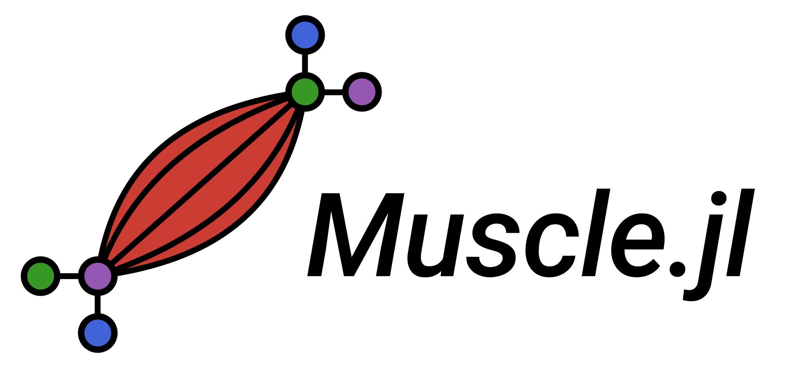

<picture>
    <source media="(prefers-color-theme: light)" srcset="docs/src/assets/logo-text.svg">
    <source media="(prefers-color-theme: dark)" srcset="docs/src/assets/logo-text-dark.svg">
    
</picture>

> :muscle: Muscles power Tensors :muscle:

<!-- [](https://mofeing.github.io/Muscle.jl/stable/) -->
[](https://mofeing.github.io/Muscle.jl/dev/)
[](https://github.com/mofeing/Muscle.jl/actions/workflows/CI.yml?query=branch%3Amain)
<!-- [](https://codecov.io/gh/mofeing/Muscle.jl) -->

Muscle.jl is a library for manipulation of tensors. It provides a `Tensor` type which wraps together an `AbstractArray` and a list of `Index`.

For example, the following tensor,
$$T_{ijk} = \begin{cases}~~~1 \qquad &i=j=k \\ -1 \qquad &\mathrm{otherwise}\end{cases}$$

can easily be created as,

```julia
T = Tensor(zeros(2,2,2), [Index(:i), Index(:j), Index(:k)]);

for I in eachindex(IndexCartesian(), T)
    (i,j,k) = Tuple(I)
    T[i,j,k] = i == j == k ? 1 : -1
end
```

A rather more interesting application is tensor contraction. `Index` labels or names are used for automatically matching contracting dimensions.

```julia
julia> a = Tensor(ComplexF64[1 2; 3 4], [Index(:i), Index(:j)])
2×2 Tensor(::Matrix{ComplexF64}) with signature ij:
 1.0+0.0im  2.0+0.0im
 3.0+0.0im  4.0+0.0im

julia> b = Tensor(ones(2,2,2), [Index(:j), Index(:k), Index(:l)])
2×2×2 Tensor(::Array{Float64, 3}) with signature ijk:
[:, :, 1] =
 1.0  1.0
 1.0  1.0

[:, :, 2] =
 1.0  1.0
 1.0  1.0

julia> binary_einsum(a, b)
2×2×2 Tensor(::Array{ComplexF64, 3}) with signature ijk:
[:, :, 1] =
 3.0+0.0im  3.0+0.0im
 7.0+0.0im  7.0+0.0im

[:, :, 2] =
 3.0+0.0im  3.0+0.0im
 7.0+0.0im  7.0+0.0im
```

## Variance behavior

An `Index` can be `Covariant`, `Contravariant` or `Invariant` (default).

```julia
julia> Index(:i)
index<i>

julia> Index(:j, Covariant)
index<j↓>

julia> Index(:k, Contravariant)
index<k↑>
```

> [!IMPORTANT]
> While variance information is important for basis change, this functionality is yet a work in progress. Currently all indices are treated as `Invariant`.

## Operations

This is a list of primitive operations that Muscle can dispatch to different backends.

#### `hadamard(!)`

a.k.a. element-wise multiplication.

```julia
julia> a = Tensor([1 2; 3 4], [Index(:i), Index(:j)]);

julia> hadamard(a, a)
2×2 Tensor(::Matrix{Int64}) with signature ij:
 1   4
 9  16
```

#### `unary_einsum(!)`

Can be used directly through `Muscle.einsum(!)`.

#### `binary_einsum(!)`

Tensor contraction. Can be used directly through `Muscle.einsum(!)`.

```julia
julia> a = Tensor([1 2; 3 4], [Index(:i), Index(:j)]);

julia> b = Tensor(Float64[-1 8; 3 5], [Index(:j), Index(:k)]);

julia> binary_einsum(a, b)
2×2 Tensor(::Matrix{Float64}) with signature ij:
 5.0  18.0
 9.0  44.0
```

Some backends allow for batching indices. In particular, Reactant.jl and OMEinsum.jl.

#### `tensor_qr_thin(!)`

Matrix QR adapted to n-order tensors with left and right indices.

```julia
julia> a = Tensor([1 2; 3 4], [Index(:i), Index(:j)]);

julia> q, r = tensor_qr_thin(a; ind_virtual=Index(:v))
([-0.316227766016838 -0.9486832980505138; -0.9486832980505138 0.316227766016838], [-3.1622776601683795 -4.427188724235731; 0.0 -0.6324555320336751])

julia> q
2×2 Tensor(::Matrix{Float64}) with signature ij:
 -0.316228  -0.948683
 -0.948683   0.316228

julia> r
2×2 Tensor(::Matrix{Float64}) with signature ij:
 -3.16228  -4.42719
  0.0      -0.632456
```

#### `tensor_svd_thin(!)`

Matrix Singular Value Decomposition (SVD) adapted to n-order tensors with left and right indices.

```julia
julia> a = Tensor([1 2; 3 4], [Index(:i), Index(:j)]);

julia> u,s,v = tensor_svd_thin(a)
([-0.40455358483375703 -0.9145142956773042; -0.9145142956773045 0.4045535848337568], [5.464985704219043, 0.3659661906262574], [-0.5760484367663209 0.8174155604703631; -0.8174155604703631 -0.5760484367663209])

julia> u
2×2 Tensor(::Matrix{Float64}) with signature ij:
 -0.404554  -0.914514
 -0.914514   0.404554

julia> s
2-element Tensor(::Vector{Float64}) with signature i:
 5.464985704219043
 0.3659661906262574

julia> v
2×2 Tensor(reshape(transpose(::Matrix{Float64}), 2, 2)) with signature ij:
 -0.576048   0.817416
 -0.817416  -0.576048
```

#### `tensor_svd_trunc(!)`

Matrix Truncated Singular Value Decomposition (t-SVD) adapted to n-order tensors with left and right indices.

#### `tensor_eigen_thin(!)`

Matrix eigendecomposition adapted to n-order tensors with left and right indices.

```julia
julia> λ, U = tensor_eigen_thin(a)
([-0.3722813232690143, 5.372281323269014], [-0.8245648401323938 -0.4159735579192842; 0.5657674649689923 -0.9093767091321241])

julia> λ
2-element Tensor(::Vector{Float64}) with signature i:
 -0.3722813232690143
  5.372281323269014

julia> U
2×2 Tensor(::Matrix{Float64}) with signature ij:
 -0.824565  -0.415974
  0.565767  -0.909377
```

#### `simple_update(!)`

A common operation performed in time-evolution algorithms.

Although most backends see it as a composite operation (i.e. they will call other operations), cuTensorNet offers it as a primitive.

## Backends

Muscle implements an unconventional backend system in which multiple backends can be used for different `Muscle.Operations` at the same time, as long as they support the same `Platform`.

Currently, Muscle supports the following `Platform`s:

- Host; i.e. CPU
- Reactant
- CUDA
- Dagger

For example, a user may want to use CuTensorNet.jl for `simple_update` and OMEinsum.jl for `unary_einsum` under the CUDA `Platform`. This is easily configured as,

```julia
using Muscle
using Muscle.Operations: setbackend!, simple_update, unary_einsum
Muscle.Operations.setbackend!(simple_update, Muscle.PlatformCUDA(), Muscle.BackendCuTensorNet())
Muscle.Operations.setbackend!(unary_einsum, Muscle.PlatformCUDA(), Muscle.BackendOMEinsum())
```

The currently support table of backends and operations is,

<!-- | **Platform**      | Host | Reactant    | CUDA             | CUDA        | CUDA           | Dagger    | Host / CUDA | -->
|                   | Base | Reactant.jl | CUDA.jl (cuBLAS) | CuTENSOR.jl | CuTensorNet.jl | Dagger.jl | OMEinsum.jl | Strided.jl |
| ----------------- | ---- | ----------- | ---------------- | ----------- | -------------- | --------- | ----------- | ---------- |
| unary_einsum      |      |             |                  |             |                |           | ✅           |            |
| binary_einsum     | ✅    | ✅           | ✅                | ✅           | ✅              | ✅         | ✅           | ✅          |
| hadamard          | ✅    |             |                  |             |                |           |             |            |
| tensor_qr_thin    | ✅    | ⌛           | ⌛                | -           | ✅              |           | -           | -          |
| tensor_svd_thin   | ✅    | ⌛           | ⌛                | -           | ✅              |           | -           | -          |
| tensor_svd_trunc  | ✅    |             |                  | -           |                |           | -           | -          |
| tensor_eigen_thin | ✅    | ⌛           | ⌛                | -           |                |           | -           | -          |
| simple_update     | ✅    | ⌛           | -                | -           | ✅              |           | -           | -          |

| Legend               |
| -------------------- |
| ✅ : implemented      |
| ➖ : doesn't apply    |
| ⌛ : work in progress |
