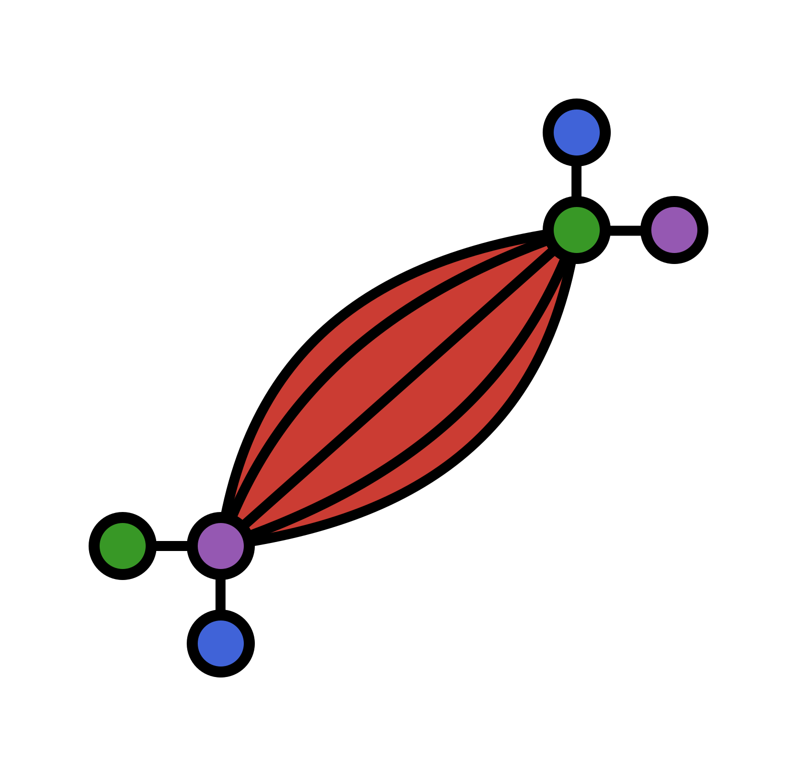

# Muscle.jl

> :muscle: Muscles power Tensors :muscle:

<!--  -->

<picture>
    <source media="(prefers-color-theme: light)" srcset="docs/src/assets/logo.svg">
    <source media="(prefers-color-theme: dark)" srcset="docs/src/assets/logo-dark.svg">
    
</picture>
